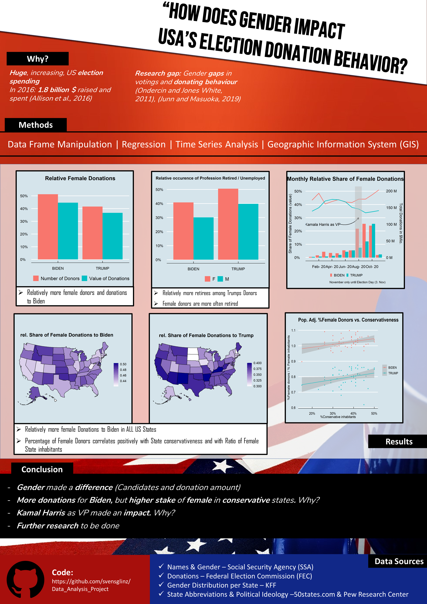

## Description 

This project was done as part of a group project for the Course Big Data for Social Analysis at NCCU. 

We look at gender related aspects in donations to the presidential Candidate Committees of Donald Trump and Joe Biden in the 2020 Presidential Election. 
We put a focus on the share of donations as well as the share of donors which are women. 

Our analysis reveals that significantly more women donated to Biden than to Trump (donation amount wise as well as in terms of number of donors). Further, around the announcement of Biden's choice to pick Kammala Harris as VP, donations to Biden shot up relative to those to Trump (both from Male and Female) and the contribution ratio from Females also increased. 

A regression analysis which aims to analyze the relative amount female donors and donations per US State further reveals that the relative share of female donors is strongly dependent on the % of female which live in a us state, but surprisingly is also influenced by the conservativeness of a US State. 

## Data 

**Data which was used in this code and which should be part of the folder "files" but is too large to upload on github can be found under:** 
- https://1drv.ms/u/s!AoQRAZtdS9u4iO9TuONDuD-JNd3SYQ?e=2w5yAi

--> The files in the donations folder are the result of a split of the original text file that was downloaded from the Federal Election Comissions Bulk Download Service (>16GB). We split the file into smaller text files with 1 Mio lines each with the git bash command split *donations.txt -l 1000000*

## Output Examples

